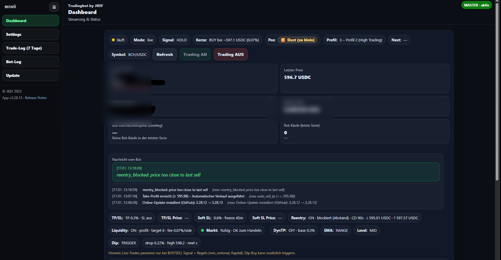
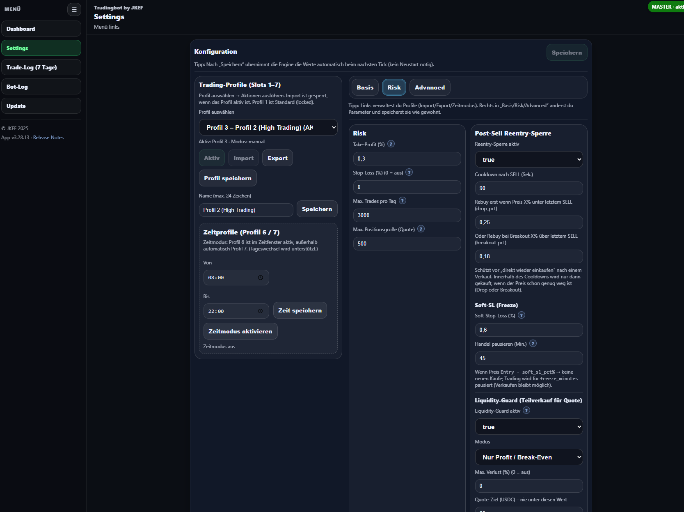
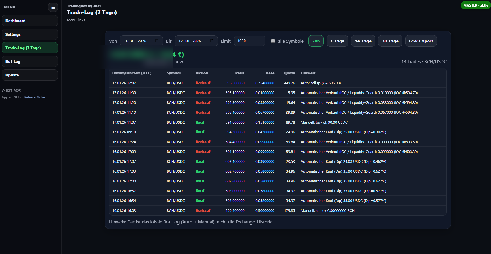
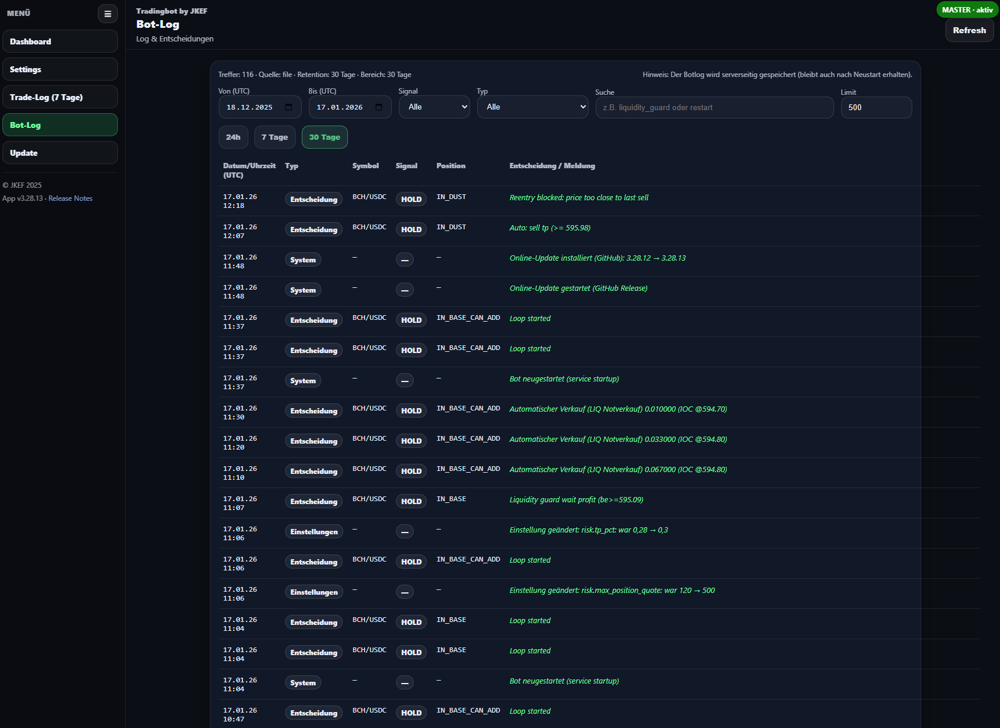
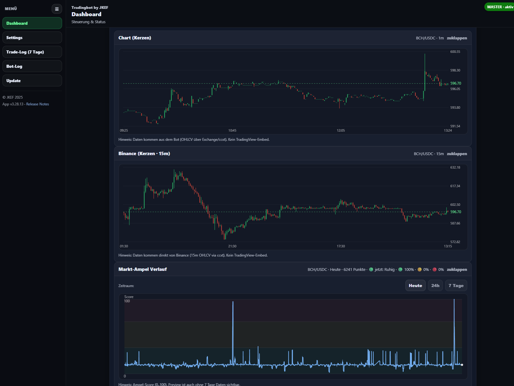
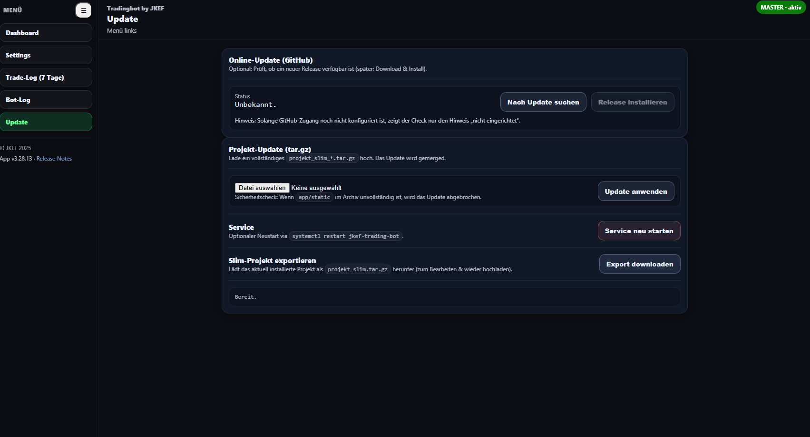

# JKEF SpotBot 🚀
**Automatisierter Spot-Trading Bot mit Web Dashboard & HTTPS Remote-Zugriff (Raspberry Pi ready)**

JKEF SpotBot ist ein Trading Bot für den 24/7 Betrieb – inklusive moderner Web-Oberfläche, Live Monitoring, Strategie-Engine und einfacher Update-/Installer-Logik.

---

## ✅ Features

### 🖥️ Web Dashboard (Live)
- 📊 Live Status (Mode, Signal, Trading AN/AUS, aktuelle Kerze/Signal)
- 💰 Portfolio Anzeige (Depot / Quote / Base, Profit)
- 🧾 Bot-Nachrichten + Ereignis-Log im Dashboard
- 📜 Trades Tabelle (letzte Trades, Auto-Refresh)
- 🔄 Live Refresh / Auto Update alle X Sekunden

### 📈 Charts & Marktanalyse
- 🕯️ Kerzenchart (OHLCV aus Bot/Exchange)
- 🟦 Vergleichschart (z.B. Binance 15m)
- 🚦 Marktampel / Score Verlauf (Ruhig / Kritisch / etc.)

### 🤖 Trading Engine
- ✅ Strategie-basiertes Spot Trading (BUY/SELL Engine)
- ✅ Take-Profit / Stop-Loss Parameter
- ✅ Soft SL (Freeze-Modus mit Minuten-Zeit)
- ✅ Reentry-Sperre nach SELL (Cooldown + Abstand)
- ✅ Dust / Min-Notional Schutz (Safety gegen zu kleine Orders)
- ✅ Liquidity Guard (Teilverkauf / Quote-Schutz)

### 🎛️ Profile & Einstellungen
- 🧩 Trading-Profile Slots (1–7)
- 💾 Profil speichern / Export / Import
- 🕒 Zeitmodus (z.B. nur 08:00–22:00 handeln)
- ⚙️ Risk / Advanced Parameter direkt im UI änderbar

### 🔐 Sicherer Zugriff & Betrieb
- 🌐 Externer Zugriff per HTTPS (Reverse Proxy ready)
- 🔁 Dauerbetrieb via systemd + Auto-Restart
- 📜 Bot-Log & Trade-Log im Dashboard

### 🔄 Update & Wartung
- ⬇️ Online Update (GitHub Release Check + Install)
- 📦 Projekt-Update via `tar.gz` Upload (Merge Update)
- 📤 Slim Export Download für schnelle Backups / Migration
- 🔧 Service Neustart direkt aus dem Web UI

---

## 🖼️ Screenshots

### Dashboard

### Settings

### Trade Log

### Bot Log

### Charts

### Update

---

🧪 Testzugang: Coming soon.

## ⚠ Hinweis
Trading ist mit Risiko verbunden. Nutzung auf eigene Verantwortung.
